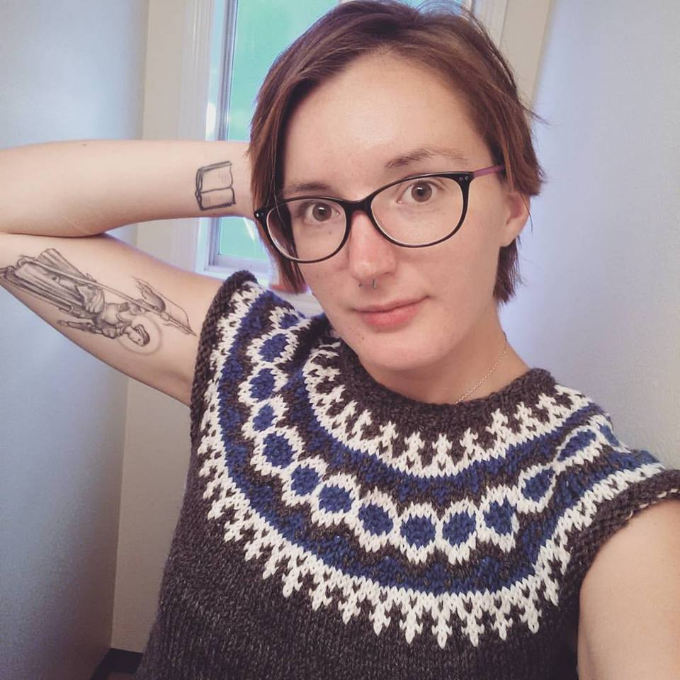

# Welcome to Flora Winter's Github User Page

I graduated from the University of Oregon with a B.A. in Folklore in June 2017.

My personal and professional interests include:
* Software and web development
* Video game design
* Fiber art including spinning and knitting
* Writing speculative fiction

My personal and writing blog can be found [here](http://thewordforgirl.blogspot.com/)
